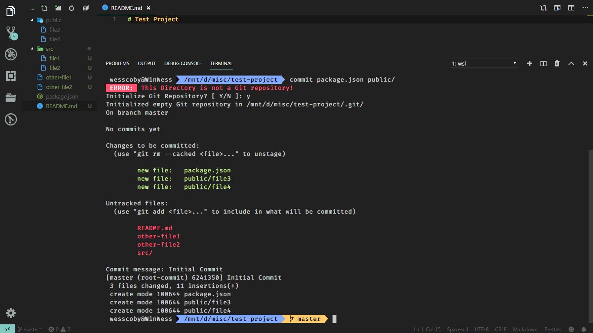

# Git Scripts
Scripts to simplify using Git

# Overview
This may seem like taking time to do a lot of work that "aliases" could have easily handled, but no! This is way more. 
Some of these scripts have been programmed to combine a series of tasks into a single command, and/or handle edge cases; the `commit` script, for instance, takes care of staging selected files first before committing; `rl` (repolink) also handles the process of adding a remote link to the newly created repo, and making the first push to the remote repo. <br> More info on them in the Scripts section. 

# Installation
Clone the project into a `.bash` folder in your home directory:
```sh
$ mkdir ~/.bash
$ cd ~/.bash
$ git clone git@github.com:WessCoby/git-scripts.git
$ cd git-scripts
```
Then run the `install.sh` file:
```sh

# Make sure you are in the root directory (git-scripts).
$  ./install.sh

# If you get a "Permission Denied" error, change the file attribute to make it executable.
$ chmod u+x install.sh

# Then run again
$ ./install.sh

```
Reload bash (`source ~/.bashrc`) or `exit` and reopen the terminal.<br>
**That's it!!!**


## Updates
This Repo will be frequently updated with new quotes. Simply run `gs-update` to pull in new updates.

# Usage
Using these scripts is quite simple. 

## Scripts
### [Commit](./bin/commit)

You don't have to use the '-m' flag with this script. All you have to do is pass the files (and/or directories) to be committed, separated by spaces, as arguments. You will be prompted to enter commit message. Thats all.

#### Examples
```sh
# Say you just need to commit a single file:
$ commit path/file-name

# Files and Directories
$ commit directory1/ path-to/another-file

# Everything
$ commit .

```
#### Edge Cases
-   If you run command in a directory that isn't initialized yet, you will be prompted to initialize directory as a git repo. 
-   You will get an error if the file(s) passed do(es) not exist in the directory. If the files passed do not exist (maybe due to typos), you will be prompted to reenter file name(s).
-   If you run the command with no argument passed, you will be prompted either to stage everything, or specify which files to commit.

### [RL (Remote Link)](./bin/rl)
One of the known ways of creating a Github repo for your project is creating an empty repository on Github, and adding it's remote link to your local repo, then pushing the local changes to the the repo.
This process takes a few steps as is usually stated on Github after creating the project. This script simplified the process. All you have to do is pass the remote link as argument to the command. 
```sh
# Add remote link and push committed files and directorries
$ rl remote-repository-link
```

### [st (Status)](./bin/st)
Simple. Git Status. Probably should have been an alias, this one :wink:
```sh
# Git Status
$ st
```

### [Push](push)
Pushing to remote repository.
```sh
# Push to master
$ push

# Push to another branch
$ push branch-name
```

## Helper Scripts
These scripts are used by the main scripts.
-   [fe](./bin/fe): Check if a file or path exists in the current directory
-   [gs-update](./bin/gs-update): Pull in new updates from the remote repository
-   [errlog](./bin/errlog): Output a formatted error message

# Contributing
Let's work together on this. Contribute in anyway you can. 